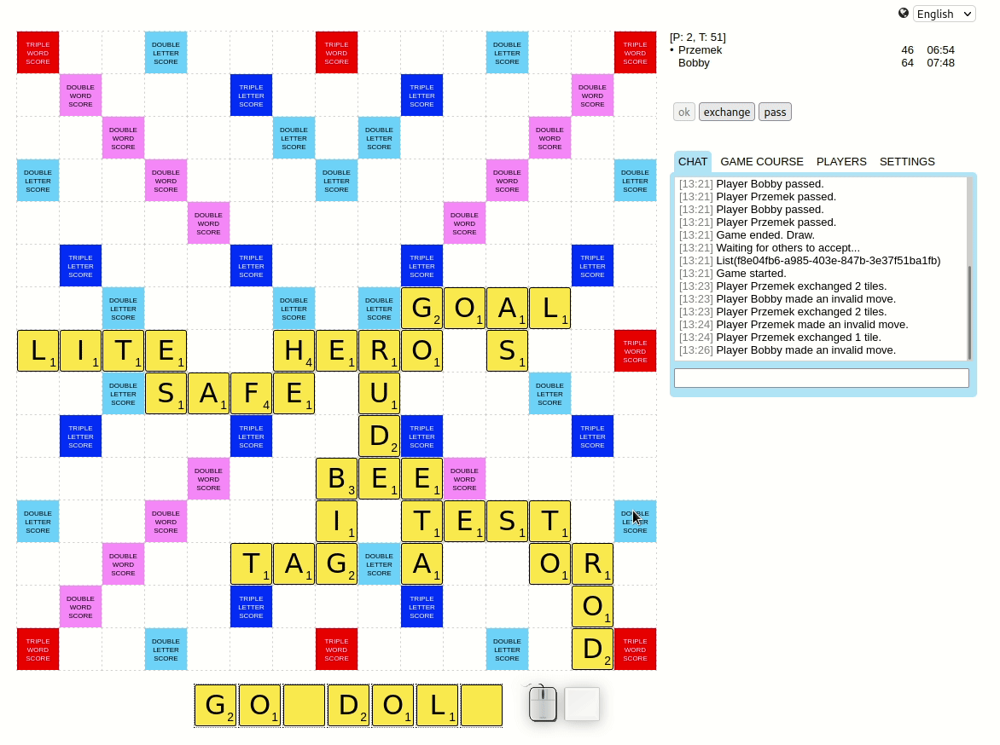

# Skłable



Skłable is a game similar to [Scrabble(TM)](https://en.wikipedia.org/wiki/Scrabble). One can play alone or with 1 to 3 other players in one of three languages:

 - Polish
 - English
 - Spanish

The game is written in Scala and Scala.js, using an excellent https://laminar.dev/ library.
## Contributing
Yes, please.

## Running locally

To run a server, start `sbt` and switch to `backend` project and run `reStart`:

```{bash}
sbt:sklable> project backend
sbt:backend> reStart  
```

## Demo

Go to https://skłable.pl